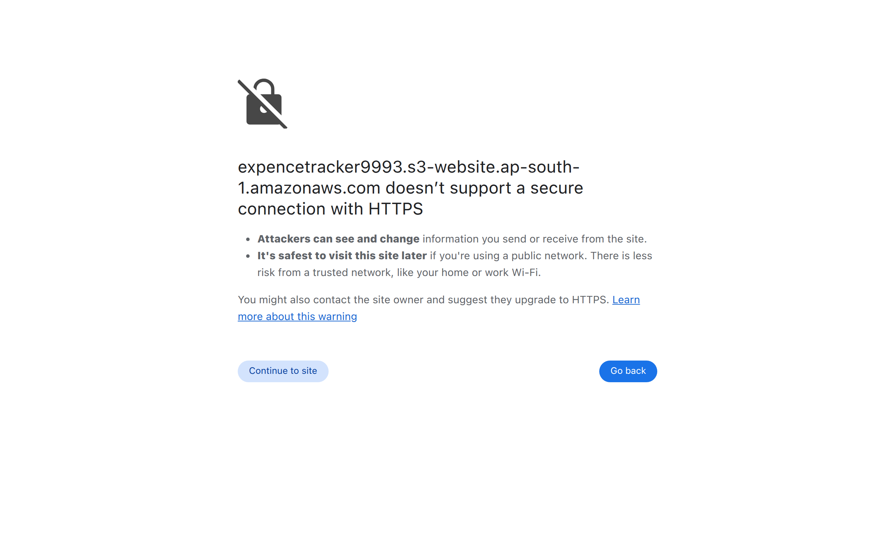
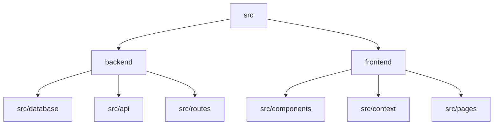

# Elegant Budget Tracker

## 🗂️ Description

The Elegant Budget Tracker is a full-stack application designed to help users manage their finances effectively. It allows users to track their income and expenses, view detailed reports, and make informed decisions about their financial health. This project is ideal for individuals seeking a simple yet powerful tool to monitor and control their spending.

The application consists of a robust backend built with Node.js, Express.js, and MongoDB, ensuring secure and efficient data management. The frontend is developed with React, Vite, and Tailwind CSS, providing a responsive and user-friendly interface.

## ✨ Key Features

### **User Authentication**
- Secure user registration and login functionality
- JSON Web Tokens (JWT) for authentication and authorization

### **Transaction Management**
- Create, read, update, and delete transactions
- Categorize transactions (income/expense)
- View detailed transaction history

### **Financial Insights**
- Visualize financial data with pie charts and summaries
- Track total income, total expenses, and net balance

### **Responsive Design**
- Mobile-friendly interface for on-the-go access
- Adaptable layout for various screen sizes

## 🗂️ Folder Structure



## 🛠️ Tech Stack


## ⚙️ Setup Instructions

### Prerequisites
- Node.js (v16 or higher)
- npm or yarn
- MongoDB (local or remote)

### Steps to Run the Project

1. **Clone the Repository**
   ```bash
   git clone https://github.com/rohitTo95/elegant-budget-tracker.git
   ```
2. **Navigate to the Project Directory**
   ```bash
   cd elegant-budget-tracker
   ```
3. **Install Dependencies**
   ```bash
   npm install
   ```
   or
   ```bash
   yarn install
   ```
4. **Start the Backend Server**
   ```bash
   cd backend
   npm run start
   ```
   or
   ```bash
   cd backend
   yarn start
   ```
5. **Start the Frontend Development Server**
   ```bash
   cd frontend
   npm run dev
   ```
   or
   ```bash
   cd frontend
   yarn dev
   ```
6. **Access the Application**
   - Frontend: [http://localhost:5173](http://localhost:5173)
   - Backend API: [http://localhost:3000](http://localhost:3000)

## 🚀 GitHub Actions

The project utilizes GitHub Actions for automated deployment and testing.

### **Deploy Frontend**
- Workflow file: `.github/workflows/deploy-frontend.yml`
- Triggers on push events to the main branch
- Deploys the frontend to an S3 bucket

### **Deploy Backend**
- Workflow file: `.github/workflows/deploy-backend.yml`
- Triggers on push events to the main branch
- Deploys the backend to an EC2 instance

## 🤝 Code Quality and Security

- **ESLint**: Configured for both frontend and backend to ensure code quality and consistency.
- **TypeScript**: Used throughout the project for type safety and maintainability.
- **Secure Dependencies**: Regularly updated to prevent vulnerabilities.


<br><br>
<div align="center">

<h3>Rohit Dutta</h3>
<p>No information provided.</p>
</div>
<br>
<p align="right">
  <a href="https://gitfull.vercel.app">Made by GitFull</a>
</p>
    